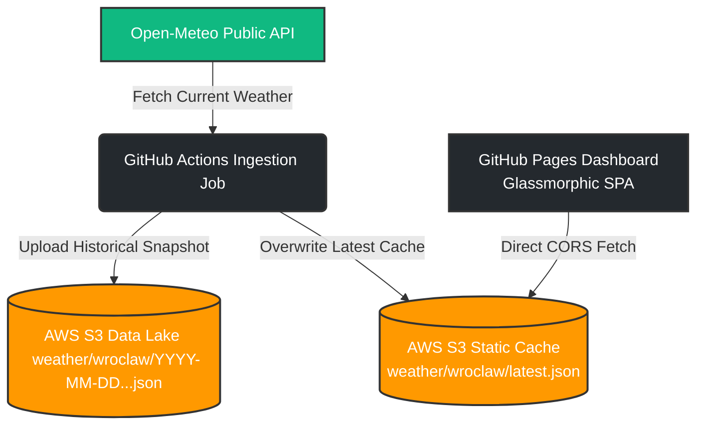

# Serverless Cloud Weather Ingestion Pipeline & Dashboard

🔗 **Live Weather Dashboard**: [wroclaw-weather-data.vercel.app](https://wroclaw-weather-data.vercel.app)

A production-ready serverless data ingestion pipeline that fetches weather data daily for Wrocław, Poland, stores it in an AWS S3 data lake, and visualizes it via a live glassmorphic web dashboard hosted on Vercel (or GitHub Pages).

Designed to demonstrate cloud architecture best practices, automated ETL pipelines, credential security, and static site integration with AWS S3.

## 🏗️ Architecture Overview

The pipeline operates entirely serverless, utilizing GitHub Actions as an orchestration engine (with complete compatibility for AWS Lambda/ECS) and AWS S3 as both a raw data lake and a lightweight static cache for client consumption.



### Key Highlights:
- **Serverless Ingestion**: No active compute cost. Ingestion runs on a daily cron schedule via GitHub Actions.
- **Data Lake (Raw Zone)**: Every run writes a unique timestamped JSON payload containing the full raw weather forecast to the S3 bucket, facilitating future analytics/Big Data processing.
- **Latest State Cache**: The pipeline also overwrites `weather/wroclaw/latest.json`. The web dashboard fetches this single file directly, avoiding expensive S3 listing operations or API gateways.
- **Robust Handling**: Features dynamic loading of local `.env` variables, built-in retry-tolerant HTTP calls, and proper `boto3` client exception catch blocks.

---

## 💻 Tech Stack
- **Languages**: Python 3.12, JavaScript (ES6+), HTML5, CSS3 (Custom Glassmorphism)
- **Cloud Infrastructure**: AWS S3, IAM (Least Privilege Policies)
- **CI/CD & Automation**: GitHub Actions, GitHub Pages
- **Libraries**: `boto3`, `urllib` (Standard Library for lightweight runtime), `python-dotenv`

---

## 📂 Project Structure
```text
├── .github/
│   └── workflows/
│       └── weather_sync.yml  # GitHub Actions automated ingestion workflow
├── docs/
│   └── index.html            # Dashboard Frontend (deployed via GitHub Pages)
├── .dockerignore
├── .env.example              # Template for local environment configuration
├── .gitignore                # Protects secrets (e.g. rootkey.csv, .env)
├── Dockerfile                # ECS/Fargate container configuration
├── lambda_function.py        # Main Python ETL logic (Lambda & Actions handler)
├── requirements.txt          # Project dependencies
└── README.md                 # Project documentation
```

---

## 🚀 Local Quickstart

### 1. Clone the repository
```bash
git clone https://github.com/<your-username>/Wroclaw-Weather-AWS-S3.git
cd Wroclaw-Weather-AWS-S3
```

### 2. Set up a virtual environment
```bash
python -m venv .venv
# On Windows
.venv\Scripts\activate
# On macOS/Linux
source .venv/bin/activate
```

### 3. Install dependencies
```bash
pip install -r requirements.txt
```

### 4. Configure local environment variables
Copy the template `.env.example` to `.env`:
```bash
copy .env.example .env
```
Fill in your S3 Bucket details and local AWS credentials in `.env`:
```ini
AWS_ACCESS_KEY_ID=your_access_key
AWS_SECRET_ACCESS_KEY=your_secret_key
AWS_DEFAULT_REGION=your_aws_region
S3_BUCKET_NAME=your-s3-bucket-name
S3_KEY_PREFIX=weather/wroclaw/
```

### 5. Run the parser locally
```bash
python lambda_function.py
```
Upon successful execution, you should see:
```json
{"message": "Weather data successfully ingested into S3 Data Lake", "bucket": "...", "historical_key": "...", "latest_key": "..."}
```

---

## 🔒 Production Setup & Security

### 1. S3 Bucket & CORS Configuration
To allow the frontend dashboard on GitHub Pages to read `latest.json` from S3, you must configure **CORS** and allow **Public Read** for that specific file.

#### A. Configure CORS
Go to your AWS Console &rarr; S3 &rarr; Your Bucket &rarr; **Permissions** &rarr; **Cross-origin resource sharing (CORS)** and paste:
```json
[
    {
        "AllowedHeaders": ["*"],
        "AllowedMethods": ["GET"],
        "AllowedOrigins": [
            "https://*.github.io",
            "https://*.vercel.app",
            "http://localhost:*"
        ],
        "ExposeHeaders": []
    }
]
```

#### B. S3 Bucket Policy
Ensure **Block public access** is turned off for the bucket (or configure object-level permissions). Add the following Bucket Policy to allow public read access *only* for the `latest.json` file:
```json
{
    "Version": "2012-10-17",
    "Statement": [
        {
            "Sid": "PublicReadLatest",
            "Effect": "Allow",
            "Principal": "*",
            "Action": "s3:GetObject",
            "Resource": "arn:aws:s3:::<your-bucket-name>/weather/wroclaw/latest.json"
        }
    ]
}
```

### 2. IAM Least Privilege Policy
Create an IAM User for the GitHub Actions pipeline. Attach a policy that strictly restricts write operations to your target bucket:
```json
{
    "Version": "2012-10-17",
    "Statement": [
        {
            "Effect": "Allow",
            "Action": "s3:PutObject",
            "Resource": "arn:aws:s3:::<your-bucket-name>/weather/wroclaw/*"
        }
    ]
}
```

### 3. GitHub Secrets Configuration
In your GitHub repository settings, navigate to **Settings > Secrets and variables > Actions** and add the following repository secrets:

| Secret Name | Description |
|---|---|
| `AWS_ACCESS_KEY_ID` | Access key for the IAM user |
| `AWS_SECRET_ACCESS_KEY` | Secret access key for the IAM user |
| `AWS_DEFAULT_REGION` | AWS Region of your bucket (e.g., `eu-central-1`) |
| `S3_BUCKET_NAME` | The S3 Bucket name |
| `S3_KEY_PREFIX` | Prefix for the keys (e.g., `weather/wroclaw/`) |

---

## 📈 Deployment to GitHub Pages

To make your Weather Dashboard public:
1. Push your code to GitHub.
2. In your GitHub repository, navigate to **Settings > Pages**.
3. Under **Build and deployment**, set the source to **Deploy from a branch**.
4. Set the branch to `master` (or `main`) and the folder to `/docs`.
5. Click **Save**. Within a few minutes, your dashboard will be live at `https://<your-username>.github.io/<repository-name>/`.
